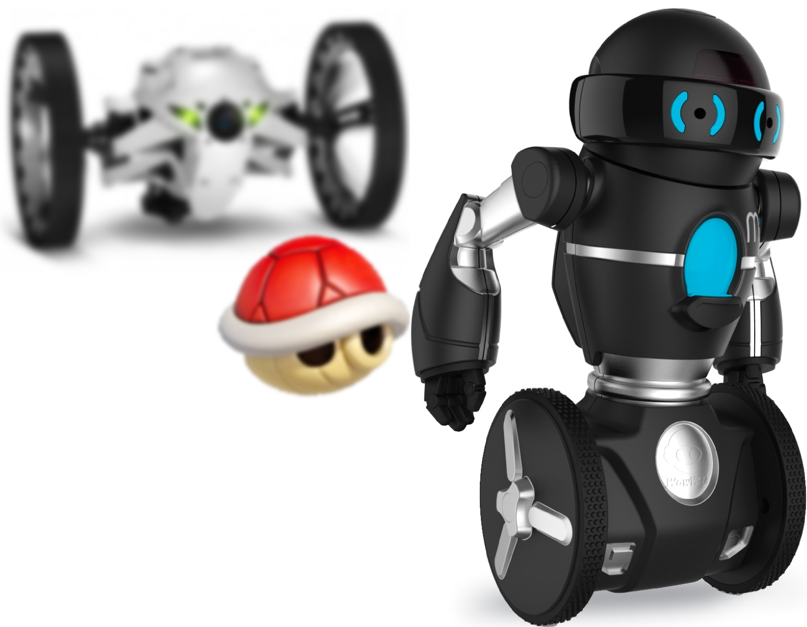

# *rosmariokart*

[](https://travis-ci.org/arnaud-ramey/rosmariokart)

A "mariokart" clone, but made for real robots.
<p align="center">

</p>


ROS driver node
===============

## 1. Dependencies included in the Ubuntu packages

Please run the [rosdep](http://docs.ros.org/independent/api/rosdep/html/) utility:

```bash
$ sudo apt-get install libsdl2-gfx-dev libsdl2-image-dev libsdl2-mixer-dev
$ sudo apt-get install python-rosdep
$ sudo rosdep init
$ rosdep update
$ rosdep install rosmariokart --ignore-src
```

## 2. To launch the game:

```bash
$ roslaunch rosmariokart rosmariokart.launch
```

Node parameters
---------------

- `~player_1_name, ~player_2_name, ~player_3_name, ~player_4_name`
  [string, default: ""]

  The name of each player. Leave empty for no player.
  At least fields `player_1_name` and `player_2_name` must be set.
  As documented below, these names will be used as namespaces to access
  various topics and parameters.

- `~curse_XXX_timeout`
  [double, seconds, default: 2 seconds]

  The duration of each curse.
  `XXX` is among the following:
  `boo, goldenmushroom, lightning, mirror, mushroom, redshell_coming, redshell_hit, star, timebomb_hit`.

- `~axis_180turn`
  [int, default: 4]

  The joystick axis to perform 180° turns.

- `~axis_90turn`
  [int, default: 3]

  The joystick axis to perform 90° turns.

- `~axis_angular`
  [int, default: 2]

  The joystick axis to control angular speed.

- `~axis_linear`
  [int, default: 2]

  The joystick axis to control linear speed.

- `~button_item`
  [int, default: 3]

  The joystick button for throwing an item.

- `/ROBOT/scale_angular`, for ex: `/mip/scale_angular`
  [int, rad.s-1/joy_unit, default: 1]

  The multiplication factor that converts an axis value into an angular speed.

- `/ROBOT/scale_linear`, for ex: `/mip/scale_linar`
  [int, rad.s-1/joy_unit, default: 1]

  The multiplication factor that converts an axis value into a linear speed.

Subscriptions
-------------

- `/ROBOT/joy`, for ex: `/mip/joy`
  [sensor_msgs::Joy]

  The joystick commands.

Publications
------------

- `/ROBOT/cmd_vel`, for ex: `/mip/scale_linar`
  [geometry_msgs::Twist]

  The speed orders.

- `/ROBOT/animation`, for ex: `/mip/animation`
  [std_msgs::String]

  Predefined animations that can be specific to each robot.
  Among `hit, lose, mock, win`.

- `/ROBOT/sharp_turn`, for ex: `/mip/sharp_turn`
  [std_msgs::Float32]

  The on-the-spot speed orders, for sharp turns like 90°.

Credits
=======

Fonts
----

  - `fonts/LCD2U___.TTF`:
    [myfontfree.com](http://www.myfontfree.com/lcd2-myfontfreecom55f70418.htm)

Images
------

  - `doc/ori-robot-mip-noir-wowwee-1280.jpg`:
    [robot-advance.com](http://www.robot-advance.com/ori-robot-mip-noir-wowwee-1280.jpg)

  - `data/items/supermariokart/Boo*.png`:
    [fantendo.wikia.com](http://fantendo.wikia.com/wiki/Boo_%28species%29)
  - `data/items/supermariokart/GoldenMushroom*.png`:
    [mariowiki.net](http://www.mariowiki.com/Golden_Mushroom)
  - `data/items/supermariokart/Lightning*.png`:
    [mariokart.wikia.com](http://mariokart.wikia.com/wiki/Lightning)
  - `data/items/supermariokart/Mushroom*.png`:
    [nintendo.wikia.com](http://nintendo.wikia.com/wiki/File:Mushroom_-_Mario_Kart_Wii.png)
  - `data/items/supermariokart/RedShell*.png`:
    [mariokart.wikia.com](http://mariokart.wikia.com/wiki/Red_Shell)
  - `data/items/supermariokart/TimeBombCurse.png`:
    [isthisabomb.com](http://isthisabomb.com/img/18.png)
  - `data/items/supermariokart/RocketStartCurse.png`:
    [mariowiki.com](http://www.mariowiki.com/images/d/de/Rocket_Start_%28Mario_Kart_8%29.jpg)
  - `data/items/supermariokart/Star.png`:
    [nintendo.wikia.com](http://nintendo.wikia.com/wiki/File:Star_-_Mario_Kart_Wii.png)
  - `data/items/supertuxkart/*`:
    [SuperTuxKart assets SVN repository](https://svn.code.sf.net/p/supertuxkart/code/stk-assets/)

  - `data/lakitu/*.png`:
    [press-select.fr](http://www.press-select.fr/wp-content/uploads/2014/05/lakitu.png)
    [mariofusion.free.fr](http://mariofusion.free.fr/images/champi-musee/lakitu/lakitu-smk.jpg)
    [deviantart.net](http://img09.deviantart.net/7014/i/2009/264/6/d/mario_kart_collab___lakitu_by_sibsy.jpg)

  - `data/robots/jumping_sumo_brown.jpg`:
    [amain.com](http://images.amain.com/images/large/pta/ptapf724002.jpg)
  - `data/robots/random_robot.png`:
    [openclipart.org](https://openclipart.org/detail/170101/cartoon-robot)
  - `data/robots/stage_black_bg.png`:
    [playerstage.org](http://playerstage.sourceforge.net/doc/stage-svn/index.html)
  - `data/robots/white_mip_black_bg.png`:
    [wowwee.com](http://store.wowwee.com/images/products/personalizations/2049.jpg)
  - `data/robots/white_sumo_black_bg.png`:
    [parrot.com](http://www.parrot.com/media/slideshows/slides/2015/01/26/165619437566.jpg)

  - `data/warnings/joypad.png`:
    [myiconfinder.com](http://www.myiconfinder.com/icon/console-control-game-games-joy-joystick-manipulator-joypad-pad-joy-color-4-flat-metro-ui-dock/2533)
  - `data/warnings/press_item.png`:
    [pixabay.com](http://pixabay.com/p-46783/?no_redirect)

Sounds
------

  - `battle-mode.mp3`, `begin-race.mp3`, `last-lap.mp3`, `you-win.mp3`:
    [khinsider.com](http://downloads.khinsider.com/game-soundtracks/album/super-mario-kart-original-soundtrack)
  - `boost.wav, boosteal.wav, cpuspin.wav, cputhrow.wav, gotitem.wav, itemreel.wav, racestart.wav, spinout.wav`:
    [superluigibros.com](http://www.superluigibros.com/super-mario-kart-sound-effects-wav)
  - `lightning.wav`:
    [youtube.com](https://www.youtube.com/watch?v=IXUoY_KgCko)
  - `mk64_countdown.wav`:
    [themushroomkingdom.net](http://themushroomkingdom.net/media/mk64/wav)
  - `quartz.wav`:
    [freesound.org](https://www.freesound.org/people/quartzgate/sounds/177868/)
  - `starman.wav`:
    [superluigibros.com](http://www.superluigibros.com/mario-kart-64-sound-effects-wav)
  - `timebomb.wav`:
    [soundbible.com](http://soundbible.com/1203-Time-Bomb.html)


Tracks
------

  - `config/bitmaps/Mariocircuit1.*`
    [mariokart.wikia.com](http://mariokart.wikia.com/wiki/Mario_Circuit_1)
